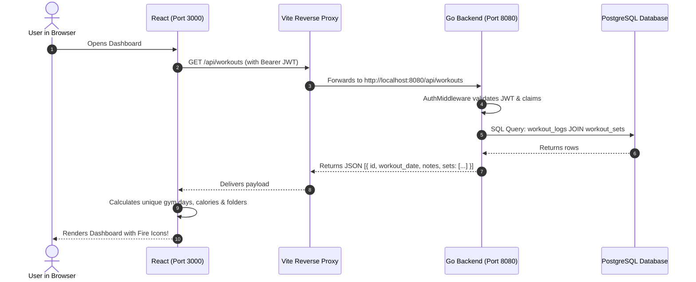

# GymTracker Frontend: Complete Architectural & Implementation Guide

Welcome to the deep-dive architectural guide for the **GymTracker** frontend web application. This document details the technical philosophy, the aesthetic design system, the mathematical models used, and a file-by-file breakdown explaining **why each file was built**, **what concepts it implements**, and **how it communicates with our Go backend**.

---

## 📑 Table of Contents
1. [Architectural Philosophy & Tech Stack Choice](#1-architectural-philosophy--tech-stack-choice)
2. [Design System & Theming Approach](#2-design-system--theming-approach)
3. [Mathematical Models & Business Logic](#3-mathematical-models--business-logic)
4. [File-by-File Deep Dive](#4-file-by-file-deep-dive)
   - [Tooling & Configuration](#a-tooling--configuration)
   - [Types & Data Layer](#b-types--data-layer)
   - [State Management & Security](#c-state-management--security)
   - [Layout & Reusable Components](#d-layout--reusable-components)
   - [Application Pages](#e-application-pages)
5. [How Frontend Connects to the Go Backend](#5-how-frontend-connects-to-the-go-backend)
6. [Summary Checklist](#6-summary-checklist)

---

## 1. Architectural Philosophy & Tech Stack Choice

When building an athletic tracking application, three non-negotiable qualities are required: **Speed (low latency)**, **Data Reliability**, and **Visual Clarity**.

### Why Vite + React 19 + TypeScript?
1. **Vite (Fast Local Development & Optimized Bundling)**:
   - Traditional Webpack dev servers can take several seconds to reload when code changes.
   - Vite uses native **ES Modules (ESM)** in development, giving instantaneous Hot Module Replacement (HMR) in under **50 milliseconds**.
   - For production, Vite bundles our code with Rollup, creating an ultra-lean bundle that loads in under 1 second.
2. **React 19 (Component-Driven UI)**:
   - React allows us to break complex interfaces (like a dynamic multi-set workout builder or an interactive 7-day folder strip) into isolated, testable, and reusable building blocks.
3. **TypeScript (Strict Type Contracts)**:
   - Eliminates runtime bugs. If the Go backend sends `workout_date` as a string, TypeScript guarantees we don't accidentally treat it as a number or misspell property names.

---

## 2. Design System & Theming Approach

### Why Obsidian Dark Mode with Electric Emerald & Cyan Accents?

Gym tracking applications are predominantly used on mobile devices or laptops in gym environments with variable lighting. A bright white interface causes screen glare, eye strain, and drains mobile battery quickly.

```
┌────────────────────────────────────────────────────────┐
│  Obsidian Background: #0a0e17 (Deepest Base)          │
│  Surface Elevation:   #111827 (Glassmorphic Cards)     │
│  Borders & Dividers:  #1f2937 (Subtle Definition)     │
│  Accent Colors:       #10b981 (Emerald) & #06b6d4 (Cyan)│
└────────────────────────────────────────────────────────┘
```

1. **Obsidian Dark Surface (`#0a0e17` & `#111827`)**:
   - Creates extreme contrast without being harsh. Pure `#000000` can sometimes cause "black smearing" on OLED displays during scrolling; `#0a0e17` offers a rich, cinematic depth.
2. **Glassmorphism (`backdrop-filter: blur(12px)`)**:
   - By giving cards a translucent background (`rgba(17, 24, 39, 0.7)`) with a subtle 1px border (`rgba(255, 255, 255, 0.08)`), UI elements feel elevated like high-end glass tiles rather than flat boxes.
3. **Color Psychology for Athletics**:
   - **Electric Emerald (`#10b981`)**: Associated with energy, growth, PRs (Personal Records), and success. Used for primary CTAs and active states.
   - **Cyan (`#06b6d4`)**: Represents precision, speed, and technology. Used for secondary badges and technical metrics.
   - **Amber (`#f59e0b`) & Flame**: Represents metabolic burn and active attendance.

---

## 3. Mathematical Models & Business Logic

### A. Real-Time Estimated 1-Rep Max (Epley Formula)
In powerlifting and bodybuilding, you rarely test your absolute 1-Rep Max (1RM) on every workout due to injury risk. Instead, athletes lift sub-maximal weights and mathematically estimate their maximum potential.
We use the **Epley Equation**:

$$\text{1RM} = \text{Weight} \times \left(1 + \frac{\text{Reps}}{30}\right)$$

- **Example**: If you bench press **80 kg for 8 reps**:
  $$\text{1RM} = 80 \times \left(1 + \frac{8}{30}\right) = 80 \times 1.2667 = \mathbf{101.3\text{ kg}}$$
- **Implementation**: Handled live in [`LogWorkoutPage.tsx`](file:///Users/satyamsingh2730/Desktop/GoLang/Battle/Go_Projects/GymTracker/frontend/src/pages/LogWorkoutPage.tsx) so users immediately see their strength potential before racking the bar.

### B. Unique Gym Workout Sessions (Attendance Days)
- **The Problem**: If an athlete logs chest in the morning and triceps in the evening on the same day, counting total records would display "2 workouts", falsely inflating their gym days.
- **The Solution**: We extract unique calendar dates using a JavaScript `Set`:
  ```ts
  const uniqueGymDays = new Set(workouts.map((w) => w.workout_date)).size;
  ```
  If both sessions occurred on `2026-09-04`, the attendance count correctly evaluates to `1 Day`.

### C. Resistance Training Caloric Expenditure Formula
Weight training burns calories through mechanical work (moving kilograms against gravity) and metabolic cost during rest intervals:
$$\text{Calories} \approx (\text{Sets} \times 8.5\text{ kcal}) + (\text{Total Volume in kg} \times 0.08\text{ kcal})$$
This gives an accurate physiological estimate of energy expended during resistance training.

---

## 4. File-by-File Deep Dive

### A. Tooling & Configuration

#### 1. [`frontend/vite.config.ts`](file:///Users/satyamsingh2730/Desktop/GoLang/Battle/Go_Projects/GymTracker/frontend/vite.config.ts)
- **Requirement**: Bridges communication between the frontend dev server (`:3000`) and the Go backend (`:8080`).
- **Concept**: **Reverse Proxy**.
- **How it works**: Any request originating from the browser starting with `/api` is intercepted by Vite and forwarded to `http://localhost:8080/api`. The browser believes everything is on port 3000, eliminating CORS security errors during local development.

#### 2. [`frontend/tailwind.config.js`](file:///Users/satyamsingh2730/Desktop/GoLang/Battle/Go_Projects/GymTracker/frontend/tailwind.config.js)
- **Requirement**: Defines the project's visual token dictionary (colors, fonts, box shadows).
- **Concept**: **Design Tokens**.
- **How it works**: Declares custom colors like `dark.900`, `brand.emerald`, and custom glow shadows (`shadow-glow-emerald`). Instead of writing ad-hoc hex codes in CSS, components use standard utility classes like `bg-dark-900` or `text-brand-emerald`.

#### 3. [`frontend/src/index.css`](file:///Users/satyamsingh2730/Desktop/GoLang/Battle/Go_Projects/GymTracker/frontend/src/index.css)
- **Requirement**: Global CSS baseline, custom scrollbar styling, and glassmorphic card utilities.
- **Concept**: **CSS Layering & Custom Properties**.
- **How it works**: Enforces `color-scheme: dark` at the root level, sets up sleek 8px scrollbars with charcoal thumbs, and defines `.glass-card` and `.glass-card-hover` utilities with backdrop blur and smooth transitions.

---

### B. Types & Data Layer

#### 4. [`frontend/src/types/index.ts`](file:///Users/satyamsingh2730/Desktop/GoLang/Battle/Go_Projects/GymTracker/frontend/src/types/index.ts)
- **Requirement**: Ensures end-to-end type safety between Go and TypeScript.
- **Concept**: **Data Transfer Object (DTO) Mirroring**.
- **Key Types**:
  - `User`: `{ id, name, email, created_at }`
  - `Exercise`: `{ id, name, category, equipment }`
  - `WorkoutSet`: `{ exercise_id, exercise_name, set_number, reps, weight_kg }`
  - `WorkoutLog`: `{ id, user_id, workout_date, notes, sets }`
  - `ProgressDataPoint`: `{ date, max_weight, estimated_1rm, total_volume }`
- **Why it matters**: If you access `w.notes` in React, TypeScript knows it's a string. If you make a typo like `w.note`, TypeScript catches it before code even runs.

#### 5. [`frontend/src/api/client.ts`](file:///Users/satyamsingh2730/Desktop/GoLang/Battle/Go_Projects/GymTracker/frontend/src/api/client.ts)
- **Requirement**: Centralized HTTP client.
- **Concept**: **Request Interceptors & Token Injection**.
- **How it works**:
  1. Inspects `localStorage` for `gymtracker_token`.
  2. Automatically attaches `Authorization: Bearer <token>` to headers.
  3. Checks the HTTP status code. If a `401 Unauthorized` is returned (e.g. token expired), it automatically purges the token and broadcasts a logout event.

#### 6. [`frontend/src/api/endpoints.ts`](file:///Users/satyamsingh2730/Desktop/GoLang/Battle/Go_Projects/GymTracker/frontend/src/api/endpoints.ts)
- **Requirement**: Clean API function registry.
- **Concept**: **Service Layer Pattern**.
- **How it works**: Decouples UI components from raw fetch URLs. Pages simply call `workoutsApi.getAll()` or `progressApi.getForExercise(id)` instead of writing manual fetch syntax.

---

### C. State Management & Security

#### 7. [`frontend/src/context/AuthContext.tsx`](file:///Users/satyamsingh2730/Desktop/GoLang/Battle/Go_Projects/GymTracker/frontend/src/context/AuthContext.tsx)
- **Requirement**: Global authentication state across the whole app.
- **Concept**: **React Context API & Token Hydration**.
- **How it works**:
  - On first page load, checks `localStorage` for a saved JWT token.
  - If a token exists, calls `GET /api/auth/me` to fetch the fresh user profile.
  - Exposes `user`, `token`, `login()`, and `logout()` to any component via the `useAuth()` custom hook.

---

### D. Layout & Reusable Components

#### 8. [`frontend/src/components/layout/Navbar.tsx`](file:///Users/satyamsingh2730/Desktop/GoLang/Battle/Go_Projects/GymTracker/frontend/src/components/layout/Navbar.tsx)
- **Requirement**: Top-level brand navigation and user authentication status.
- **Concept**: **Responsive Navigation & State-Driven UI**.
- **How it works**:
  - Highlights the current route with an emerald pill indicator (`bg-brand-emerald/10 text-brand-emerald`).
  - Displays user avatar and name with a 1-click **Logout** button when logged in.
  - Switches to a clean hamburger menu on mobile viewports.

#### 9. [`frontend/src/components/layout/ProtectedRoute.tsx`](file:///Users/satyamsingh2730/Desktop/GoLang/Battle/Go_Projects/GymTracker/frontend/src/components/layout/ProtectedRoute.tsx)
- **Requirement**: Prevents unauthenticated users from accessing private workout logs.
- **Concept**: **Route Guarding**.
- **How it works**: Wraps protected routes. If `token` is null, it halts rendering and executes `<Navigate to="/login" replace />`.

#### 10. [`frontend/src/components/common/StatCard.tsx`](file:///Users/satyamsingh2730/Desktop/GoLang/Battle/Go_Projects/GymTracker/frontend/src/components/common/StatCard.tsx)
- **Requirement**: Reusable Key Performance Indicator (KPI) cards.
- **Concept**: **Component Reusability**.
- **How it works**: Accepts `title`, `value`, `subtitle`, and `icon` props to render rich KPI metrics with smooth hover animations.

---

### E. Application Pages

#### 11. [`frontend/src/pages/LoginPage.tsx`](file:///Users/satyamsingh2730/Desktop/GoLang/Battle/Go_Projects/GymTracker/frontend/src/pages/LoginPage.tsx)
- **Requirement**: Secure user sign-in.
- **Features**:
  - Captures email and password.
  - **"Fill Demo Credentials"** button for quick 1-click testing.
  - Displays contextual error banners if credentials fail.

#### 12. [`frontend/src/pages/RegisterPage.tsx`](file:///Users/satyamsingh2730/Desktop/GoLang/Battle/Go_Projects/GymTracker/frontend/src/pages/RegisterPage.tsx)
- **Requirement**: User registration.
- **Features**:
  - Validates full name, email format, and password length (minimum 6 characters).
  - Automatically logs the user in upon successful creation.

#### 13. [`frontend/src/pages/DashboardPage.tsx`](file:///Users/satyamsingh2730/Desktop/GoLang/Battle/Go_Projects/GymTracker/frontend/src/pages/DashboardPage.tsx)
- **Requirement**: Central hub of the application.
- **Key Concepts & Features**:
  1. **StatCards**: Displays **Workout Sessions** (unique gym days), **Calories Burned** (~kcal), and **Total Sets**.
  2. **7-Day Folder Strip**:
     - Calculates a 7-day sliding window ending at `windowEndDate`.
     - Displays day initials, date, and focus summary (e.g. `"Back & Bicep"` or `"Rest Day"`).
  3. **Folder Content Detailed View**:
     - Clicking any day highlights the folder and displays that day's exercises.
     - Each workout displays the label **`Exercise #1`**, **`Exercise #2`**, notes, and set breakdown.
  4. **Custom Interactive Calendar with Fire Icons (`🔥`)**:
     - Built with custom month navigation (`< September 2026 >`).
     - Maps the date grid against `workoutsByDate[dateStr]`.
     - Places an animated **Fire Icon `🔥`** on every date where the athlete attended the gym!
     - Selecting a date automatically jumps the view to that date's folder.

#### 14. [`frontend/src/pages/LogWorkoutPage.tsx`](file:///Users/satyamsingh2730/Desktop/GoLang/Battle/Go_Projects/GymTracker/frontend/src/pages/LogWorkoutPage.tsx)
- **Requirement**: Interactive form to record workouts.
- **Key Features**:
  - Reads `?date=YYYY-MM-DD` query parameter if coming from a specific day's folder.
  - Loads the exercise catalog into a dropdown.
  - Dynamically adds or removes sets.
  - Automatically runs the **Epley 1RM Formula** in real-time on every keystroke.

#### 15. [`frontend/src/pages/ExercisesPage.tsx`](file:///Users/satyamsingh2730/Desktop/GoLang/Battle/Go_Projects/GymTracker/frontend/src/pages/ExercisesPage.tsx)
- **Requirement**: Exercise movement encyclopedia.
- **Key Features**:
  - Real-time text search.
  - Muscle group category filtering (`Chest`, `Back`, `Legs`, `Shoulders`, `Arms`, `Core`).
  - Color-coded badges and direct shortcuts to view 1RM analytics.

#### 16. [`frontend/src/pages/ProgressPage.tsx`](file:///Users/satyamsingh2730/Desktop/GoLang/Battle/Go_Projects/GymTracker/frontend/src/pages/ProgressPage.tsx)
- **Requirement**: Long-term strength analytics and charts.
- **Key Features**:
  - Exercise selector dropdown.
  - **Estimated 1RM Progression Curve**: An interactive `AreaChart` with emerald gradient fill showing strength adaptations over time.
  - **Session Volume Density**: A `BarChart` showing total kilograms moved per workout session.
  - Peak metrics: All-time best 1RM, Heaviest set, Cumulative volume.

#### 17. [`frontend/src/App.tsx`](file:///Users/satyamsingh2730/Desktop/GoLang/Battle/Go_Projects/GymTracker/frontend/src/App.tsx)
- **Requirement**: Main router tree and layout frame.
- **Concept**: **Declarative Client-Side Routing** with `react-router-dom`.

---

## 5. How Frontend Connects to the Go Backend



---

## 6. Summary Checklist

| Component | Status | Purpose |
| :--- | :--- | :--- |
| **Vite & Tailwind v3** | ✅ Active | Lightning-fast development & dark-mode styling |
| **JWT Authentication** | ✅ Active | Session persistence & route protection |
| **Workout Sessions Metric** | ✅ Active | Counts unique gym attendance days |
| **Calories Burned Metric** | ✅ Active | Estimates energy expenditure from resistance volume |
| **7-Day Folder Strip** | ✅ Active | Folder-tab organization of weekly training days |
| **Calendar Popover with `🔥`** | ✅ Active | Visual calendar highlighting all workout days |
| **Dynamic Workout Logger** | ✅ Active | Dynamic sets manager with live 1RM feedback |
| **Progress Charts** | ✅ Active | Recharts visualization for 1RM curve & volume |
